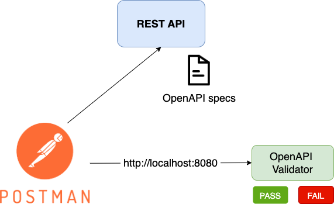
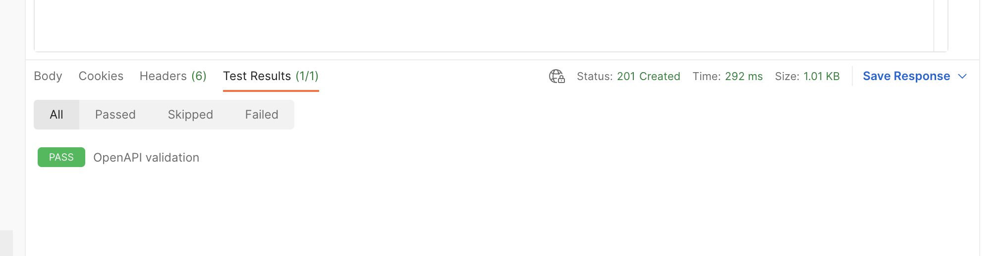

# OpenAPI validator

Validation of requests/responses according to the OpenAPI specs.

This tool allows to verify that requests/responses are valid according to the OpenAPI specification of the API.

## How does it work?

Use Postman to test/work with your API and use [Test Scripts](https://learning.postman.com/docs/writing-scripts/test-scripts/) to send `request`, `response` and `headers` to the validator. 
The Test is passed when the API specification is respected.




## How to run

Steps:
* add the snippet below in the Collection Tests
* provide the OpenAPI file
* launch the `openapi-request-response-validation` tool ([Java app](#start-the-tool-java) or using [Docker](#start-the-tool-docker)) 
* run the Postman requests against your service or application 

### Collection Test snippet

In the **Collection Tests** add the snippet below. It will run after every request in the collection.  

What does it do? After executing the request the Test Script will send `request`, `response` and `headers` to the validator.

```
openapiRequestResponseValidation = {
    validate: function(pm) {

        const postRequest = {
            url: 'http://localhost:8080/validate',
            method: 'POST',
            header: {'Content-Type': 'application/json'},
            body: {
            mode: 'raw',
            raw: JSON.stringify({ 
                method: pm.request.method, 
                path: pm.request.url.getPath(),
                headers: pm.request.headers,
                requestAsJson: (pm.request.body != "") ? pm.request.body.raw : null,
                responseAsJson: pm.response.text(),
                statusCode: pm.response.code
                })
            }
        };

        pm.sendRequest(postRequest, (error, response) => {
            if(error != undefined) {
                pm.expect.fail('Unexpected error ' + error);
            } else {
                var data = response.json();

                if(data.valid == false) {
                    console.log(data.errors);
                }

                pm.test("OpenAPI validation", () => {
                    pm.expect(data.valid, "Invalid request/response (check Console)").to.equal(true);
                });

            }
        });  
    }

};

openapiRequestResponseValidation.validate(pm);
```

### Provide the OpenAPI spec file

Copy/rename your OpenAPI specs to `openapi/openapi.yaml` or `openapi/openapi.json`

### Start the tool (Java)

Run the Java application 
```shell
    java -jar target/openapi-request-response-validator.jar
```

Run the Java application with custom port and spec file
```shell
    java -jar target/openapi-request-response-validator.jar --server.port=8888 --INPUT_SPECS=/path/to/myopenapi.yaml
```

### Start the tool (Docker)

You can run the tool on Docker

```
# run using default openapi/openapi.yaml or openapi/openapi.json
docker run -v $(pwd):/openapi -it --rm --name openapi-request-response-validation \
 gcatanese/openapi-request-response-validation

# run using custom location of the OpenAPI file
docker run -v $(pwd):/openapi -e INPUT_SPECS=/tmp/openapi.yaml \
  -it --rm --name openapi-request-response-validation \
    gcatanese/openapi-request-response-validation
```

### Run Postman requests

Run the Postman requests and check the Test tab




---
Using [Atlassian Swagger Validator](https://bitbucket.org/atlassian/swagger-request-validator/), [Postman](https://postman.com) 
and [Docker](https://docker.com)

